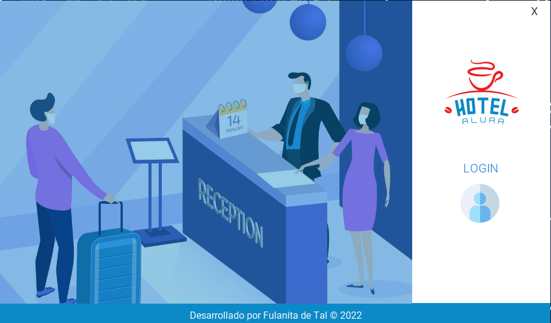
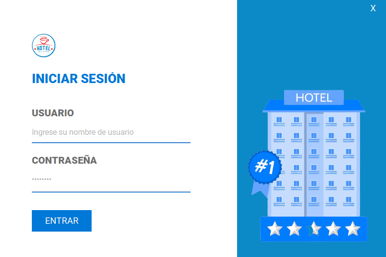
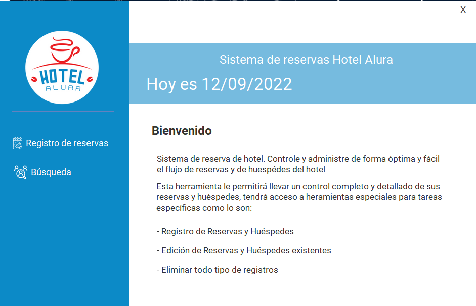
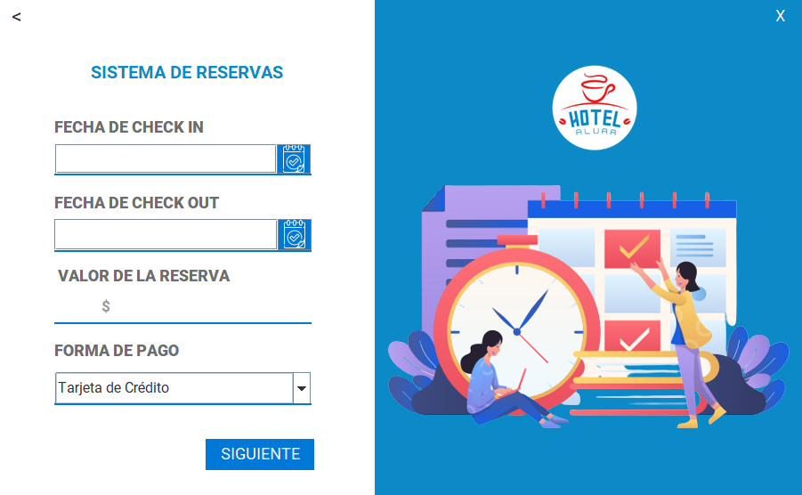
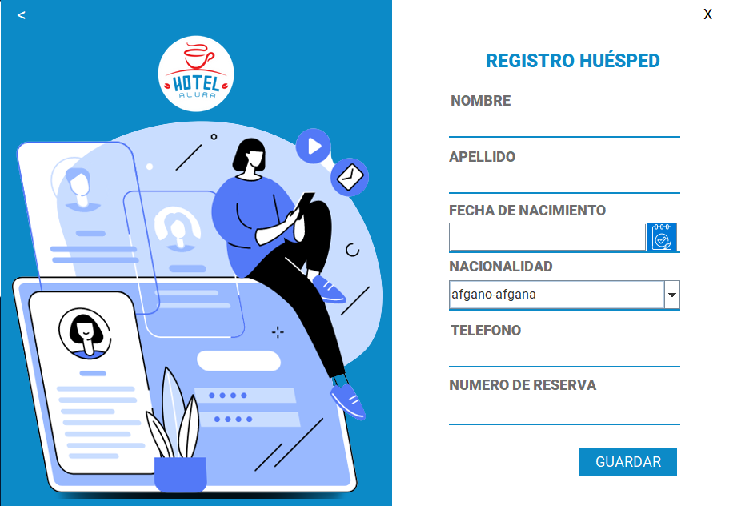
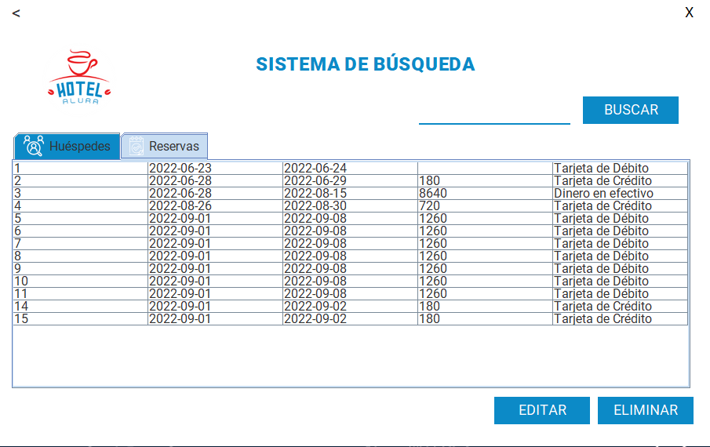
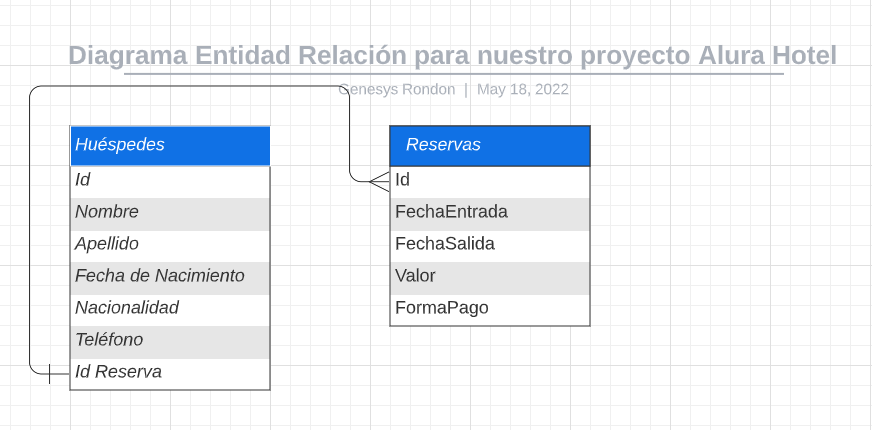

<div align="center">
   <h1>Challenge ONE | Java | Back End | App Desktop - Hotel Alura</h1>
</div>


<p align="center">
  
  <br>
  
  
</p>

<p align="center" >
  
</p>

👨🏻‍💻 <strong>Gerson Escobedo Pérez </strong></br>
<a href="https://www.linkedin.com/in/gerson-escobedo/" target="_blank">
</a>

## Índice

* [📜 Descripción del proyecto](#descripción-del-proyecto)

* [📝 Estado del proyecto](#estado-del-proyecto)

* [🖥️ Características y demostración del Proyecto](#características-y-demostracion-Proyecto)

* [📖 Acceso al proyecto](#acceso-proyecto)

* [🖥️ Tecnologías utilizadas](#tecnologías-utilizadas)

* [💙 Personas Contribuyentes](#personas-contribuyentes)

* [Licencia](#licencia)

# 📜 Descripción del proyecto
<p>El sistema de gestión de reservas de hospedaje del Hotel Alura es una aplicación desktop 
diseñada para administrar todas las actividades relacionadas con las reservas de las
habitaciones que dispone el hotel para los clientes.</p>

## Acerca del Hotel Alura y lo que solicitó:
### El Hotel Alura conocido por su espectaculares instalaciones y paquetes promocionales para Desarrolladores de Software está teniendo problemas para llevar el control de las reservaciones hechas por sus clientes, por eso solicitan nuestra ayuda para desarrollar un sistema de reserva que contenga:
1. Sistema de autenticación de usuario para que solo usuarios pertenecientes al hotel consigan acceder al sistema;
2. Permitir crear, editar y eliminar una reserva para los clientes;
3. Buscar en la base de datos todas las informaciones tanto de los clientes como de las reservas;
4. Registrar, editar y eliminar datos de los huéspedes;
5. Calcular el valor de la reserva en base a la cantidades de días de la reserva y a una tasa diaria de $ 500.00, por ejemplo si tenemos una reserva de 3 dias y el valor de nuestra diaria son $500.00 debemos multiplicar esos 3 dias por el valor de la diaria, lo que serian 1500$, todo esto deberá ser hecho automaticamente y mostrado al usuario antes de guardar la reserva;
6. Base de datos para almacenar todos los datos pedidos anteriormente.

## Vistas Solicitadas
1. Menu Principal


2. Login


3. Menu Usuario


4. Reservas


5. Registro Huesped


6. Busqueda Huesped



# 📝 Estado del proyecto
<p>
   
</p>

# 🖥️ Características y demostración del Proyecto
### Codigo SQL para la creación de la BD:
- Recomendacion: Crear primero la BD y sus tablas luego codificar en Eclipse.

```sql
drop database if exists hotel_alura;
create database if not exists hotel_alura;
use hotel_alura;

-- - Tabla Reservas

CREATE TABLE reservas (
id INT AUTO_INCREMENT,
fecha_entrada DATE, 
fecha_salida DATE, 
valor VARCHAR(12), 
forma_pago VARCHAR(25),
PRIMARY KEY(id)
)Engine=InnoDB;

-- - Tabla huespedes

CREATE TABLE huespedes (
id INT AUTO_INCREMENT,
nombre VARCHAR(25),
apellido VARCHAR(25),
fecha_nacimiento DATE,
nacionalidad VARCHAR(25),
telefono VARCHAR(12),
id_reserva INT,
PRIMARY KEY(id),
FOREIGN KEY (id_reserva) REFERENCES reservas(id)
)Engine=InnoDB;

-- - Tabla Usuarios

CREATE TABLE usuarios(
id INT PRIMARY KEY AUTO_INCREMENT,
usuario VARCHAR(20) NOT NULL,
contrasena VARCHAR(20) NOT NULL,
nombre VARCHAR(20) NOT NULL,
apellido VARCHAR(20) NOT NULL,
email VARCHAR(30),
telefono VARCHAR(12)
)Engine=InnoDB;

-- -  Insercion de los usuarios
INSERT INTO usuarios(usuario, contrasena, nombre, apellido, email, telefono) 
	values ("admin1", "admin1", "Gerson", "Ep", "gersonEp@gmail.com", "42536578"),
			("Ziz", "ziz", "Sasori", "Arena Roja", "sasori@gmail.com", "52536578");
-- - Select
select * from reservas;
select * from huespedes;
select * from usuarios;

```

* Enlaces TRELLO de referencia:
  * https://trello.com/c/K4wD3odb/17-sobre-el-desaf%C3%ADo
* Diseño de la BD: 
  * 
    
### Video del funcionamiento de la aplicacion
[](https://www.youtube.com/watch?v=oF_mIjLhQR0)

# 📖 Acceso al proyecto
1. Clonar repositorio:

```zsh
git clone https://github.com/Gerson121295/App-Desktop-Challenge_Hotel_Alura.git
```
2. Ir al directorio del proyecto:

```zsh
cd App-Desktop-Challenge_Hotel_Alura
```
3. Abrir el proyecto en Eclipse:

```zsh
Listo
```

# 🖥️ Tecnologías utilizadas
- Eclipse IDE
- ☕ Java 17
- Biblioteca JCalendar
- MySQL
- JPA Hibernate
- 🎨 Interfaces de usuario con Java Swing
- 🎨 Plugin WindowBuilder
- Biblioteca C3PO para crear Pool de conexiones

## ⚠️ Importante! ⚠️
☕ Usar Java versión 8 o superior para compatibilidad. </br></br>
📝 Recomiendo usar el editor de Eclipse para compatibilidad con la Interfaz Gráfica. </br></br>
🎨 La interfaz contiene dos métodos importantes:
- setResizable(false): determina el tamaño de la ventana, y a través del parámetro <strong>false</strong>, la pantalla no se puede maximizar;
- setLocationRelativeTo(null): determina la ubicación de la ventana, y a través del parámetro <strong>null</strong> la mantiene centrada en la pantalla.


## :pushpin: Arquitectura
- Modelo-Vista-Controlador (MVC)
- Patrón de diseño Data Access Object (DAO)


# 💙 Personas Contribuyentes
## Autores
[<br><sub>Gerson Escobedo</sub>](https://github.com/gerson121295)

# Licencia

  
License: [MIT](License.txt)


